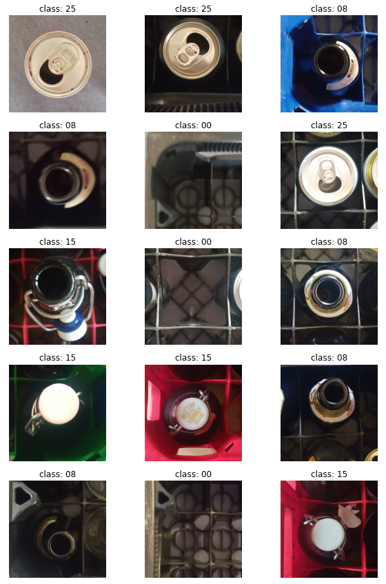
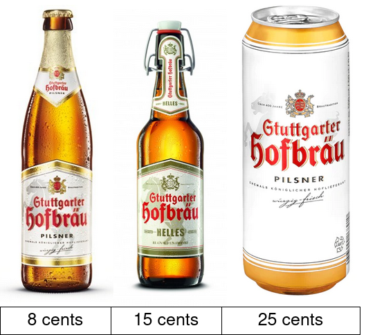
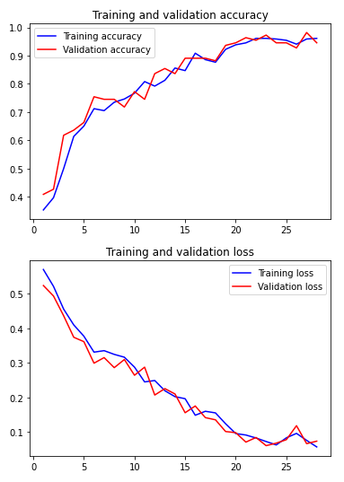
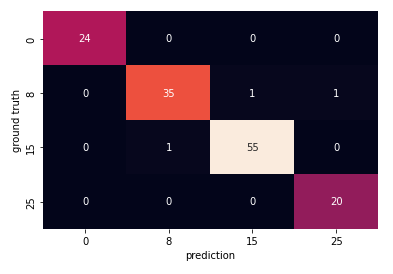
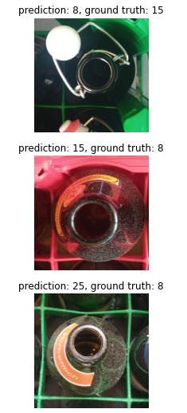

# PFAND Classifier
A CNN multi-class classifier recognising a price category of empty bottles deposits in German Pfand system, trained and tested on own dataset 

## Table of Contents
- [Dataset](https://github.com/marcinstopyra/pfand_clf#dataset)
- [Data preprocessing](https://github.com/marcinstopyra/pfand_clf#Data-preprocessing)
- [Data labeling](https://github.com/marcinstopyra/pfand_clf#Data-labeling)
- [CNN Classifier](https://github.com/marcinstopyra/pfand_clf#CNN-Classifier)
- [TODOs](https://github.com/marcinstopyra/pfand_clf#TODOs)

## Dataset
The dataset contains >650 pictures of bottles/cans/empty slots in the box taken from above. Example samples:

All pictures show a single object in a box or outside, they are all preprocessed by code contained in [dataset_preprocessing_Pfand_clf.ipynb](https://github.com/marcinstopyra/pfand_clf/blob/master/dataset_preprocessing_Pfand_clf.ipynb) notebook (more about preprocessing in next section)

The dataset imperfections:
- Dataset is biased - it consists only photos collected by me and my friends, therefore the bottles on the photos are from drinks popular in our local community. Most of samples contain drinks produced in local area (Baden-Württemberg beers - Stuttgarter Hofbrau, Wulle, Das Echte etc.) and  popular among students (cheap beer brands like Oettinger, Club Mate softdrinks, redbull cans). More samples of new drinks should be added.
- Most of the photos were taken with the same devices - more photos from different devices should be added
- Dataset does not contain any plastic bottles (huge part of 25 cents deposit value category)

### Why pictures from the top?
The initial idea was simple, just take picture of the bottle. But this approach leads to many problems in training a network and would require much much bigger training dataset. The data I gathered with my friends was not as big and it was a bit biased, it consisted mostly of the beers produced in the local area (Stuttgart region - Stuttgarter Hofbräu, Schwaben Bräu beers etc.), cheap brands (Oettinger, Hasseröder etc.) caffeine drinks popular among students (Club Mate, Red Bull etc.) Therefore, there is a high possibility that the features learned by the model will be also biased. For example, the model can learn label designs or logos. 

We can clearly see this problem when we look at different products of Stuttgarter Hofbräu. In the pictures, we have 3 Pfand beer containers, each of them having a different value. In the training dataset, there is a much higher number of the samples presenting a regular pilsner bottle (value - 8 cents) than the other two, which are less popular on Campus due to their higher price and lower availability in nearby shops. We can then expect the model to learn to associate the Stuttgarter Hofbräu logo with the 8 cents value category, which would lead to mistakes every time it sees the same logo on the bottle with a swing top or on a can.

This problem can be easily tackled by classifying the bottles based on the pictures taken from a bird's perspective. As we can see the main feature of differing value categories can be seen on the neck of the bottle (type of closure) and the cans obviously are easily recognised from the top too. From this perspective, the labels are not visible, which prevents the model from learning some misleading features.

## Data preprocessing
Data preprocessing is conducted by the code from [dataset_preprocessing_Pfand_clf.ipynb](https://github.com/marcinstopyra/pfand_clf/blob/master/dataset_preprocessing_Pfand_clf.ipynb) notebook. The raw images are read from a raw_data folder, they are rotated if needed, resized to desired smaller size, cropped and saved in ready_data directory. The preprocessed raw samples are moved from raw_data folder to another backup folder.

## Data labeling
Samples were labeled manually with use of labeling tool created by GitHub user Dida-do [[GH repository](https://github.com/dida-do/public/tree/master/labelingtool)]. The programme was modified to meet the requirements of the project

## CNN Classifier
In the last notebook - [pfand_clf.ipynb](https://github.com/marcinstopyra/pfand_clf/blob/master/pfand_clf.ipynb) the CNN classifier is built. The dataset is split into train and test split containing:
- train set - 80% samples
- test set - 20% samples

The CNN model contains a data ugmentation submodel build of layers:
- RandomFlip
- RandomRotation
- RandomZoom

Final model hyperparameters:
- number of convolutional layers and number of filters in each of them,
- activation function
- batch size
- dropout layers

were optimised through randomized search conducted for 40 randomly chosen parameter sets from the parameter grid. Each of tested models was cross-validated on 3 KFolds.

The final model parameters:
- filters: [32, 64, 128, 256, 512],
- activation: 'relu',
- batch size: 32,
- no dropouts

The training was stopped after 28 epochs because the model started to overfit to training set. The tarining history graphs showed stable rise of validation accuracy and stable decrease in validation loss

**The test accuracy of final model was: 0.9781**

Confusion matrix was created to show which samples were mispredicted:

Mispredicted samples:

## TODOs:
There are few extensions planned for the project:
- automatic labeling of new samples with use of semi-supervised learning (KMean clustering)
- development of an application that would take a picture of a box full of mixed pfand bottles/cans/empty slots, put a grid on it, classify each slot and calculate the summed up value of deposit
- deployment of programme mentioned above in form of web/mobile application